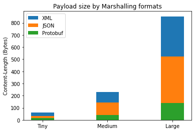

# Distributed Systems 2020/2021 Homework 1 - Alessio Cosenza

<!--  -->
## Introduction
During nodes intercommunication, both when using TCP or UDP, the payload to send has to be **marshalled**. Marshalling is the process of transforming memory representation of an object to a format suitable for transmission. During recent years different marshalling methods were used, such as: XML, JSON, Protocol Buffers, etc... <br>
The purpose of this report is to analyze Protocol Buffer's payload size and compare it with other common marshalling methods (XML and JSON).

Some common knowledge concepts will be briefly introduced for clarity sake.

## XML
**eXtensible Markup Language** (XML) is a markup language used for the representation of arbitrary data structure, commonly used in web services. It is a textual data format that is both human-readable and machine-readable.

XML basic example:
```xml
<?xml version="1.0" encoding="UTF-8"?>
<catalog>
    <book>
        <name>The Lord of the Rings</name>
        <author>J.R.R. Tolkien</author>
        <year>1954</year>
    </book>
    <book>
        <name>The Hobbit</name>
        <author>J.R.R. Tolkien</author>
        <year>1937</year>
    </book>
</catalog>
```

During recent years XML has been criticized mainly for its verbosity. For this reason JSON replaced XML as the de-facto standard format to use in intercommunication systems.

## JSON
**JavaScript Object Notation** is a human-readable data interchange format. It consists of key-value pairs and array data types. It is derived by JavaScript programming language but nowadays the majority of programming language supports JSON via its API. Every value is typed and supported types are:

* number
* string
* boolean
* array
* object
* null

JSON basic example:

```json
{
    "catalog": [
        {
            "name": "The Lord of the Rings",
            "author": "J.R.R. Tolkien",
            "year": 1954
        },
        {
            "name": "The Hobbit",
            "author": "J.R.R. Tolkien",
            "year": 1937
        }
    ]
}
```

## Protocol Buffers
**Protocol Buffers** is a language agnostic method of serializing structured data. It was developed and internally used by Google since 2001. In 2008 Google made it open source. It is based on an Interface Description Language (the .proto file) and a tool (protoc) which is used to generate source code for different programming languages that enables the usage of Protocol Buffers via defined API. Protocol Buffers is a binary format, so it is not human-readable and not self-describing, but it uses way less data than the JSON and XML.

Basic .proto example:

```proto
syntax = "proto3";
package main;

message Book {
    string Name = 1;
    string Author = 2;
    uint32 Year = 3;
}

message Catalog {
    repeated Book Books = 1;
}
```

In this example we define 2 different data structures, **Book** and **Catalog**. Each data structure has its own properties. Each property has a data type and an associated number which represents its position inside the serialized message.

Supported data types are:

* bool
* bytes
* double
* enum
* fixed32
* fixed64
* float
* int32
* int64
* message
* sfixed32
* sfixed64
* sint32
* sint64
* string
* uint32
* uint64

Arrays are supported using the **repeated** keyword.

## LXD/LXC
**Linux Containers** is a virtualization method for running multiple containers on a single Linux kernel. In this report this technology is used in order to have two different communicating environments (server and client).

## Client and Server

Two differenct LXD containers were used, using the following **init** command:

`lxc init ubuntu <container_name> -c security.privileged=true -c security.nesting=true -c "linux.kernel_modules=iptable_nat, ip6table_nat, ebtables, openvswitch, nbd"`

Resulting containers are interconnected between a bridge network.

### Server

The server used in this report is written in Go. A `.proto` file is defined and it can be found in `server/utils/library.proto` but it is also reported here:

```proto
syntax = "proto3";
package main;

option go_package = ".;librarypb";

message Author {
    string name = 1;
    string surname = 2;
}

message Publisher {
    string name = 1;
}

message Date {
    uint32 day = 1;
    uint32 month = 2;
    uint32 year = 3;
}

message Time {
    uint32 hours = 1;
    uint32 minutes = 2;
}

message Book {
    repeated Author authors = 1;
    Publisher publisher = 2;
    Date date = 3;
    uint32 pages = 4;

    enum BookState {
        AVAILABLE = 0;
        NOT_AVAILABLE = 1;
    }

    BookState state = 5;
}

message Library {
    repeated Book books = 1;
    Time opening_time = 2;
    Time closing_time = 3;
}
```

It represents a basic Library model. `protoc` was used in order to generate Go source code for creating and using the messages defined:

`protoc -I=utils --go_out=./protos utils/library.proto`

The output can be found in `server/protos/library.pb.go`.

Example of usage:

```go
book := &pb.Book{
    Authors: []*pb.Author{
        &pb.Author{
            Name:    "Mario",
            Surname: "Rossi",
        },
    },
    Date: &pb.Date{
        Day:   5,
        Month: 4,
        Year:  2010,
    },
    Pages: 500,
    Publisher: &pb.Publisher{
        Name: "Mondadori",
    },
    State: pb.Book_AVAILABLE,
}
```

In order to use also XML and JSON marshalling formats Go structs are defined with the same structure as the `.proto` file, definitions can be found in `server/structs.go` but they are also reported here:

```go
package main

type Author struct {
	Name    string
	Surname string
}

type Publisher struct {
	Name string
}

type Date struct {
	Day   uint32
	Month uint32
	Year  uint32
}

type Time struct {
	Hours   uint32
	Minutes uint32
}

type State int

const (
	Available State = iota
	NotAvailable
)

type Book struct {
	Authors   []Author `xml:"Authors>Author"`
	Publisher Publisher
	Date      Date
	Pages     uint32
	State     State
}

type Library struct {
	Books       []Book `xml:"Books>Book"`
	OpeningTime Time
	ClosingTime Time
}
```

In `server/main.go` an HTTP Server is defined. It exposes 9 endpoints, 3 for each marshalling format (tiny, medium and large payload size). Defined endpoints are:

* /json/tiny
* /json/medium
* /json/large
* /xml/tiny
* /xml/medium
* /xml/large
* /protobuf/tiny
* /protobuf/medium
* /protobuf/large

Obviously the only difference between each `tiny` (but it's also true for `medium` and `large`) endpoint is the marshalling format used, the marshalled data is the same.

### Client

The client is written in Python and it can be found under the `client` folder. It is also provided here:

```python
import requests

BASEURL = 'http://<server_container_ip>:8080'

def getContentLength(encoding, size):
    r = requests.get(f'{BASEURL}/{encoding}/{size}')

    return r.headers['content-length']


if __name__ == '__main__':
    print(f"JSON-encoding, tiny: {getContentLength('json', 'tiny')} bytes")
    print(f"JSON-encoding, medium: {getContentLength('json', 'medium')} bytes")
    print(f"JSON-encoding, large: {getContentLength('json', 'large')} bytes")

    print(f"Protobuf-encoding, tiny: {getContentLength('protobuf', 'tiny')} bytes")
    print(f"Protobuf-encoding, medium: {getContentLength('protobuf', 'medium')} bytes")
    print(f"Protobuf-encoding, large: {getContentLength('protobuf', 'large')} bytes")

    print(f"XML-encoding, tiny: {getContentLength('xml', 'tiny')} bytes")
    print(f"XML-encoding, medium: {getContentLength('xml', 'medium')} bytes")
    print(f"XML-encoding, large: {getContentLength('xml', 'large')} bytes")u
```
This script uses the `requests` python package to make HTTP GET requests to the Go server and than it prints the `Content-Length` of the responses.

Launching it leads to the following output:

```bash
(env) ubuntu@DSLab:~/ds_homework1_client$ python main.py 
JSON-encoding, tiny: 34 bytes
JSON-encoding, medium: 142 bytes
JSON-encoding, large: 521 bytes
Protobuf-encoding, tiny: 14 bytes
Protobuf-encoding, medium: 41 bytes
Protobuf-encoding, large: 139 bytes
XML-encoding, tiny: 59 bytes
XML-encoding, medium: 228 bytes
XML-encoding, large: 853 bytes
```

Visual representation:



## Conclusions

As we can see Protobuf leads to smaller payloads than both JSON and XML.

Tiny-size payloads: protobuf uses 41% of data used by JSON and 24% of data used by XML.

Medium-size payloads: protobuf uses 29% of data used by JSON and 18% of data used by XML.

Large-size payloads: protobuf uses 27% of data used by JSON and 16% of data used by XML.

For this and other reasons (such as: [performance benchmark json vs protobuf](https://auth0.com/blog/beating-json-performance-with-protobuf/#:~:text=Protobuf%20messages%20were%209%25%20smaller,available%20to%20the%20JavaScript%20code.&text=On%20these%20situations%2C%20Protobuf%20performs,available%20to%20the%20JavaScript%20code.)) Protocol Buffers is gaining popularity among IT communities. It is also at the core of [gRPC](https://grpc.io/): an RPC framework developed by Google which exploits Protobuf's performance (and other technologies like HTTP2) to provide a high-performance communication channel. Given its speed it is mainly used as a communication protocol between microservices deployed at large scale.